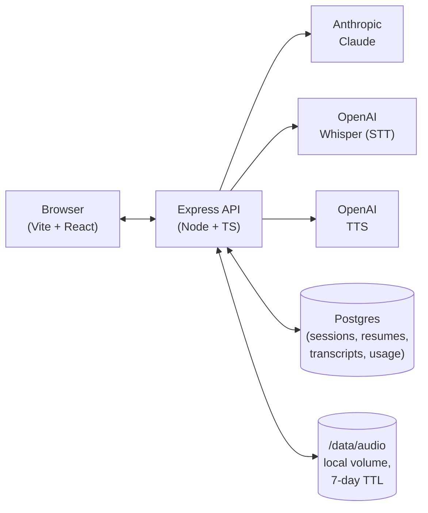
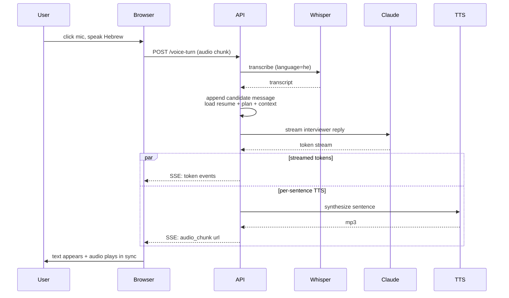
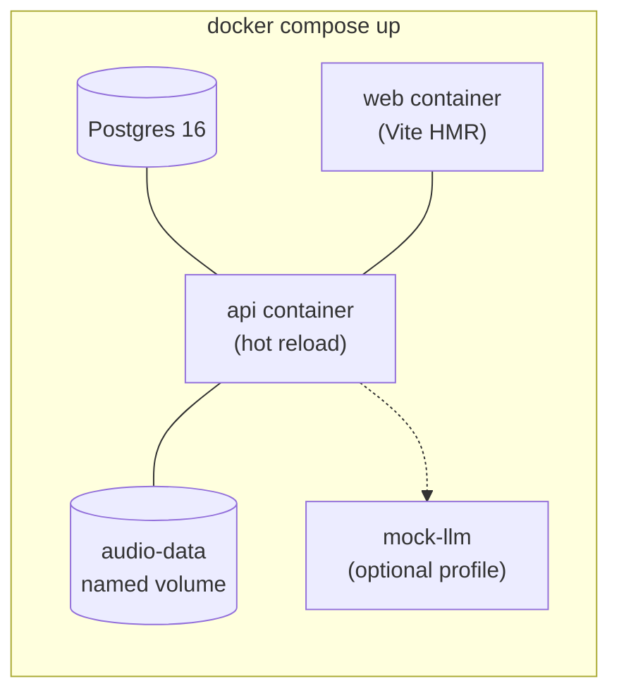

# interview-coach-il

**A Hebrew-first technical interview coaching web app for software engineers.**

Practice technical interviews in Hebrew (or English), get tailored mock interviews based on your resume and target companies, and use a free-form Hebrew technical tutor for study. Phase 1 is a shareable, no-auth tool for the author and a small group of friends.

> 📋 **Project status:** Design phase complete. Implementation has not started.
> Full design spec: [`docs/superpowers/specs/2026-05-28-interview-coach-il-design.md`](docs/superpowers/specs/2026-05-28-interview-coach-il-design.md).

---

## What it does

The agenda is to make interview preparation **less lonely and more honest**: most software engineers in Israel practice alone, with English-only material that doesn't match how they actually think under pressure. This tool fills that gap.

Four modes share one app:

| Mode | What it does | Who it's for |
|---|---|---|
| **Gap Analyzer** | Upload your resume + paste target job descriptions → get a strengths / gaps / 2-week study plan per role. | Anyone deciding what to study before applying. |
| **Text Mock Interview** | Agent plays the interviewer in a multi-round mock tailored to your resume + the target role. Suggests a plan; you edit it. Ends with structured feedback. | Anyone preparing for a specific company. |
| **Voice Mock Interview** | Same as text mode, but spoken in Hebrew. Whisper transcribes; Claude responds; OpenAI TTS speaks the reply. Closest to a real interview feel. | Practicing under realistic conditions, especially Hebrew interviews. |
| **Hebrew Q&A Tutor** | Free-form chat for technical study (algorithms, system design, behavioral framing). Teaching-tone, code blocks, mermaid diagrams. | Studying a specific topic without an interview frame. |

### What this is NOT

This is a **coaching and practice tool**. It is not designed to assist anyone during a real interview with an actual employer. That would be cheating and is explicitly out of scope.

---

## System design

### High-level architecture



**Server-side keys.** Anthropic and OpenAI API keys live only on the server (in `.env` locally, in Fly secrets in production). The browser never sees them. Phase 1 has no auth — sessions are identified by an opaque token stored in localStorage and shareable via `?s=<token>`. Data has a 7-day TTL across the board.

### Per-turn data flow — voice mock interview (the most complex path)



The latency target is **time-to-first-audio under 2.5 seconds**. Prompt caching on Claude's side keeps per-turn cost down to ~$0.01 once the interview is underway.

### Local-first development model

The full stack runs in containers on a laptop before anything touches the cloud:



- `docker compose up` — boot the full stack on `http://localhost:5173`.
- `docker compose --profile mock up` — adds a mock-LLM service so day-to-day UI work spends $0 on real APIs.
- `docker compose -f docker-compose.yml -f docker-compose.prod-local.yml up` — runs the **production** Dockerfiles locally as a parity check. Rule: if this command works, `fly deploy` will work.

---

## Estimated cost

The headline number is **AI-dominated, not infrastructure-dominated**: ~86% of every dollar goes to Anthropic and OpenAI. Hosting choice barely moves the needle at this scale.

### Phase 1 monthly run cost — 6 active users

**Assumptions:** 6 people, ~3 mock interviews/week each, ~60 turns/interview (half voice, half text), 5 gap analyses/user/month, 30 Q&A questions/user/month. Sonnet 4.6 for routine turns, Opus 4.7 for gap analysis and end-of-interview feedback, with prompt caching active.

| Category | Detail | $/month |
|---|---|---:|
| Fly.io compute | 1 vCPU / 1 GB | $5.00 |
| Fly.io volume | 10 GB for audio | $1.50 |
| Fly.io Postgres | Development cluster | $15.00 |
| Domain | `.com` amortized | $1.00 |
| **Infra subtotal** | | **$22.50** |
| Claude — interview turns | Sonnet, ~7,200 turns | $58.00 |
| Claude — gap analysis + feedback | Opus, 30 + 72 calls | $41.00 |
| Claude — Q&A tutor | Sonnet, 180 calls | $4.00 |
| Whisper STT | ~600 min Hebrew audio | $4.00 |
| OpenAI TTS | ~3,600 voice turns | $27.00 |
| Resume parsing | 30 resumes | $0.30 |
| **AI subtotal** | | **$134.30** |
| **Total** | | **~$157** |

### Sensitivity ranges

- **Light usage** (6 users, mostly casual): **$80–120/mo**
- **Steady usage** (assumptions above): **$140–165/mo**
- **Heavy usage** (everyone practicing daily before real interviews): **$250–350/mo**

The single largest tuning knob is the end-of-interview feedback prompt. Switching it from Opus to Sonnet drops that line item from $41/mo to ~$8/mo with some loss of feedback depth. Voice TTS is the second-biggest controllable cost — keeping interviewer turns short via the prompt directly bounds it.

### Mandatory guardrails (set before any real API key goes into the app)

- Anthropic dashboard: **$200/mo hard cap**, alert at $100.
- OpenAI dashboard: **$100/mo hard cap**, alert at $50.
- App-level: 30 LLM calls/hr + 5 audio uploads/min per session token, bounding worst-case session burn at ~$5/hr.

Combined: worst-case monthly spend even with a leaked session token is bounded at $300, not unbounded.

---

## Tech stack

- **Frontend:** Vite + React + TypeScript, Tailwind (RTL-aware).
- **Backend:** Node.js + Express + TypeScript.
- **DB:** Postgres 16.
- **AI:** Anthropic Claude (Sonnet/Opus), OpenAI Whisper (Hebrew STT), OpenAI TTS.
- **Hosting:** Fly.io (Frankfurt region).
- **Local dev:** Docker Compose, with a mock-LLM service for offline work.

## Getting started

> Implementation has not started yet. These commands will work once Phase 1 is built.

```bash
git clone git@github.com:theDude30/interview-coach-il.git
cd interview-coach-il
cp .env.example .env   # add ANTHROPIC_API_KEY and OPENAI_API_KEY, OR set MOCK_LLM=1
docker compose up
# open http://localhost:5173
```

## Project status & roadmap

- ✅ **Phase 0 — Design:** spec written, reviewed, committed.
- ⏳ **Phase 1 — Implementation:** scaffold + four modes + local-first deploy parity + Fly deploy. (Plan being written next.)
- 🔮 **Phase 2 — Beyond MVP:** real auth, S3 audio storage, WebSocket voice, mobile, BYOK option.

## Further reading

- 📄 [Full design spec](docs/superpowers/specs/2026-05-28-interview-coach-il-design.md) — every architectural decision, data model, prompt structure, threat model, and evolution path.

## License

Private / unlicensed in Phase 1. Not yet open-sourced.
